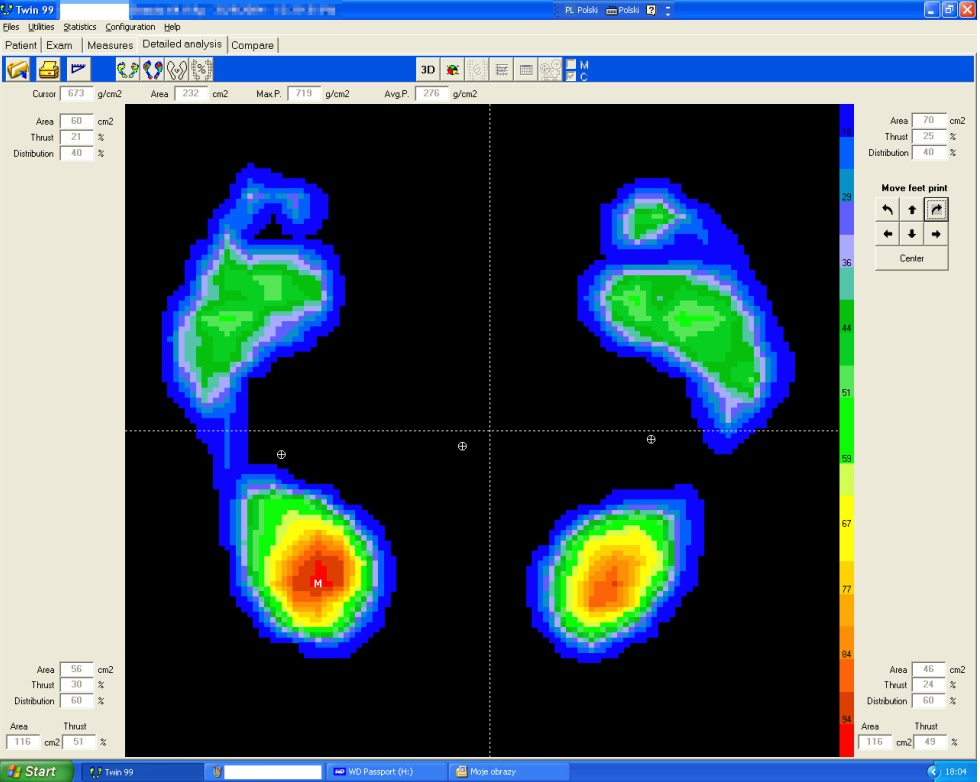
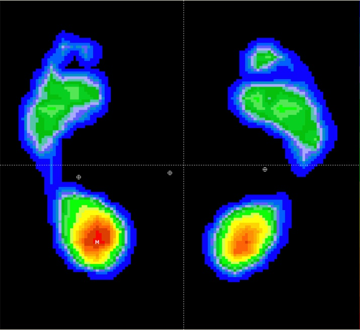

# ROI_Extraction

In this script we load the file into python framework using opencv's cv2 and then make a grayscale varient of that.
On that greyscale varint we apply thresholding keeping in veiw that ROI(region of intrest) has black background. we apply contouring
and sort them in decreasing manner of area,for this problem we now required contour will have maximum area.After getting the required contour we apply ractangle function and get the starting coordinate(top-left) and  width , height of the required area which we then crop from the actual colour image and then save that croped image back to the output directory. 
<table>
 <tr>
  <td> </td>
  <td width="200px"></td>
  <td>
 </tr>
 <tr>
  <td align='center'>We have these screenshots</td>
  <td></td>
  <td align='center'>We are to extract this from this</td>
 </tr>
</table>
